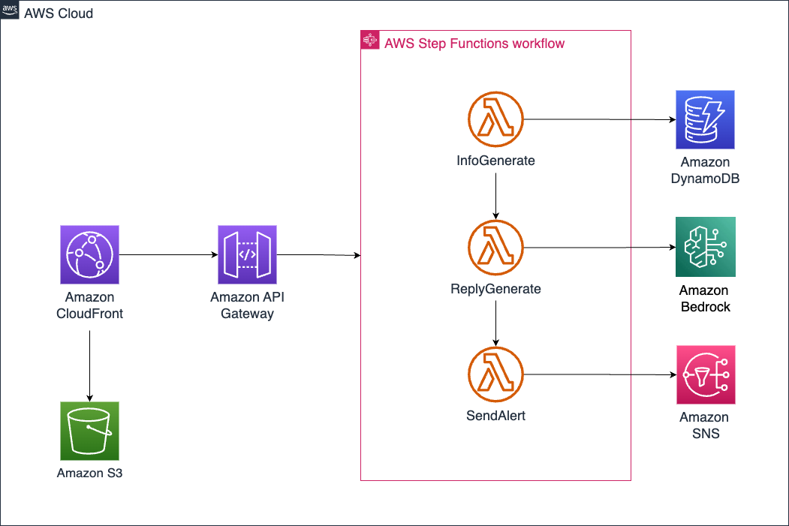
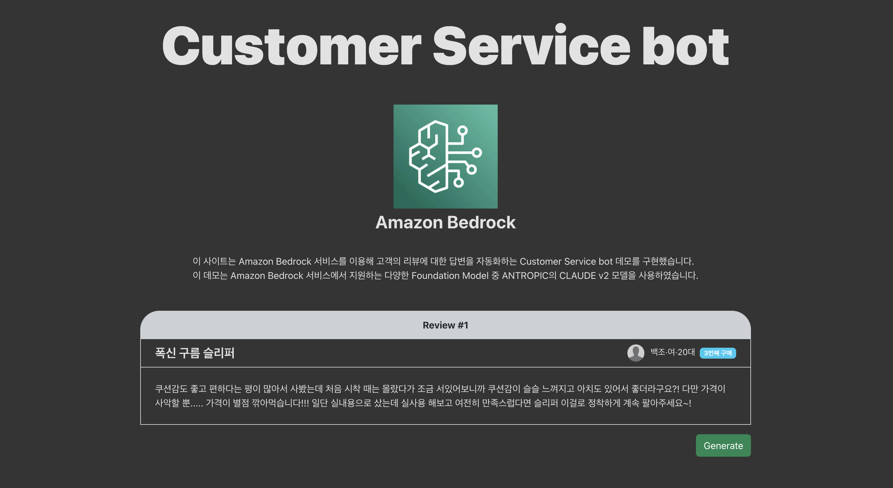
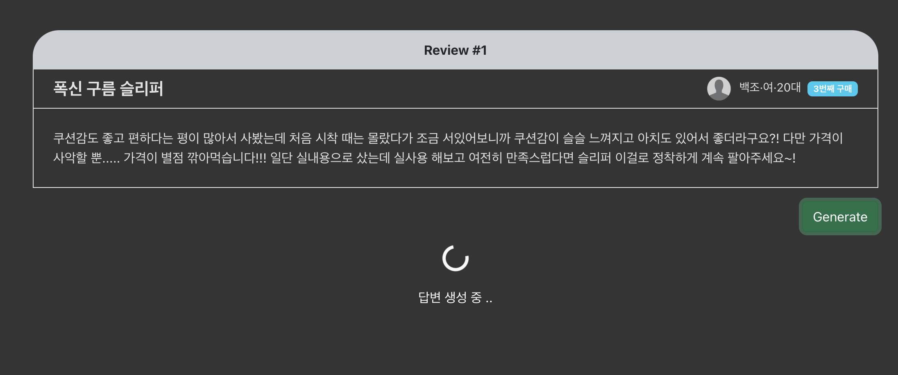
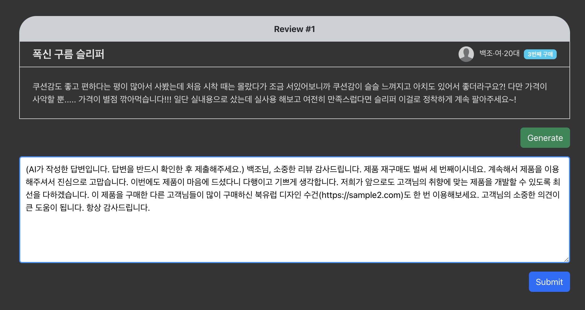
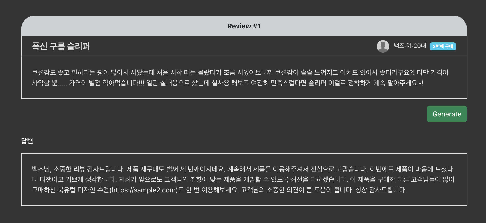
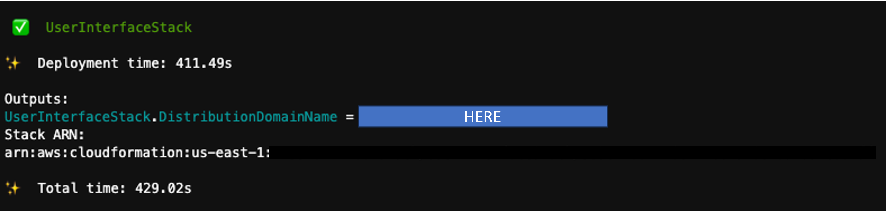

# Bedrock Customer Service Demo

## Overview

### Architecture



### UI

#### Main



#### Reply generation



#### Reply edit



#### Submit



## How to run this demo

### Project setup

1. Download github source and install dependencies
   ```shell
   git clone https://github.com/seungwon2/Bedrock-cs-demo.git  && npm i
   ```
2. Install front-end dependencies and build artifacts
   ```shell
   cd fe && npm i
   ```
   ```shell
   npm run build && cd ..
   ```

### Working with CDK

1. CDK bootstrap
   ```shell
   cdk bootstrap
   ```
2. Deploy the first stack
   ```shell
   cdk deploy BedrockCsDemoStack
   ```

### Modify .env

1. Go to `Bedrock-cs-demo/fe/.env`
   ```shell
   SKIP_PREFLIGHT_CHECK=true
   REACT_APP_API=""
   REACT_APP_STATEMACHINE=""
   ```
2. Replace `REACT_APP_API` and `REACT_APP_STATEMACHINE` using `BedrockCsDemoStack` output
   ```shell
   SKIP_PREFLIGHT_CHECK=true
   REACT_APP_API="https://your_stack_APIEndpoint"
   REACT_APP_STATEMACHINE="arn:your_stack_STATEMACHINE_ARN"
   ```
3. (Optional) If you want to modify reviews, please go to `Bedrock-cs-demo/fe/src/review.js` and replace values. You can use another languages if Claude v2 supports.

   ```js
   //review.js
   //replace values
   var reviews = {
     products: [
       {
         index: "1",
         user: {
           age: "20대",
           sex: "여",
           name: "백조",
           purchased: "3",
           product: "폭신 구름 슬리퍼",
         },
         comment:
           "쿠션감도 좋고 편하다는 평이 많아서 사봤는데 처음 시착 때는 몰랐다가 조금 서있어보니까 쿠션감이 슬슬 느껴지고 아치도 있어서 좋더라구요?! 다만 가격이 사악할 뿐..... 가격이 별점 깎아먹습니다!!! 일단 실내용으로 샀는데 실사용 해보고 여전히 만족스럽다면 슬리퍼 이걸로 정착하게 계속 팔아주세요~!",
       },
       {
         index: "2",
         user: {
           age: "10대",
           sex: "여",
           name: "오리",
           purchased: "1",
           product: "오리 피규어 5set",
         },
         comment: "이 피규어들 너무 귀여워요 보기만 해도 미소가 지어져요",
       },
       {
         index: "3",
         user: {
           age: "30대",
           sex: "남",
           name: "거위",
           purchased: "2",
           product: "매콤 쫄깃 족발",
         },
         comment:
           "아 여기 족발 너무 맛없어요. 다시는 안 시킬겁니다. 사장님 일 똑바로 하세요.",
       },
     ],
   };
   ```

### Working with front-end

1. Build react project

   ```shell
   cd fe && npm run build
   ```

2. Depoly second Stack

   ```shell
   cd .. && cdk deploy UserInterfaceStack
   ```

### Check demo page



Copy and paste the DistributionDomain name on your web browser.

## Trouble shooting

### node version error on Cloud9

This project used nodejs version 16, Cloud9 using node v18 as a default setting. You can use commands below to resolve this error.

```shell
node version error on Cloud9

node -v
sudo yum remove -y nodejs
wget -qO- https://raw.githubusercontent.com/nvm-sh/nvm/v0.38.0/install.sh | bash
sudo yum install -y nodejs16
node -v

curl -sL https://rpm.nodesource.com/setup_16.x | sudo bash -
sudo yum install -y nodejs
export PATH="/usr/bin:$PATH"
node -v
sudo yum update
sudo yum clean all
```
